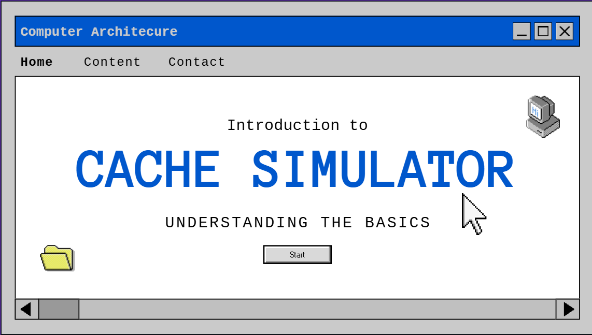
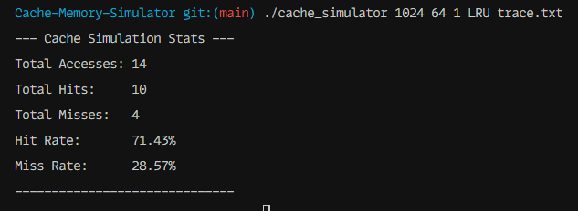

<h1 align="center">Cache Simulator in C</h1> 

<div align="center" >
  
</div>


This project is a flexible cache simulator written in C. It is designed to simulate different cache organizations and replacement policies to analyze their performance based on a given memory access trace.

It supports:

  * **Cache Organizations:**
      * Direct-Mapped
      * N-Way Set-Associative
      * Fully-Associative
  * **Replacement Policies:**
      * Least Recently Used (LRU)
      * First-In, First-Out (FIFO)

## 🚀 Getting Started

### 1. Compilation

To compile the project, navigate to the root `cache-simulator/` directory in your terminal and simply run `make`:

```bash
make
```

This will read the `Makefile`, compile all necessary files, and place the final executable named `cache_simulator.

### 2\. Cleaning the Project

To remove all compiled files and clean the project, run:

```bash
make clean
```

This will delete the entire `build/` directory.

## 💻 How to Run the Simulator

The program is run from the command line with five required arguments.

### Syntax

```bash
./cache_simulator <cache_size> <block_size> <associativity> <policy> <test_file>
```

**Arguments:**

  * **`<cache_size>`**: Total cache size in bytes (e.g., `1024`).
  * **`<block_size>`**: Block size in bytes (e.g., `64`).
  * **`<associativity>`**: N-way associativity.
      * `1` for Direct-Mapped
      * `N` for N-Way Set-Associative
      * `0` for Fully-Associative (or use the total number of lines)
  * **`<policy>`**: Replacement policy (`LRU` or `FIFO`).
  * **`<test_file>`**: Path to the memory trace file (e.g., `trace.txt`).

### 📚 Examples

Here are a few examples using a 1024-byte cache, 64-byte blocks, and the `trace.txt` file.

**Example 1: Direct-Mapped (1-Way) with LRU**

```bash
./cache_simulator 1024 64 1 LRU trace.txt
```

**Example 2: 4-Way Set-Associative with FIFO**

```bash
./cache_simulator 1024 64 4 FIFO trace.txt
```

**Example 3: Fully-Associative with LRU**
(A 1024-byte cache with 64-byte blocks has 16 lines. You can either use `16` or `0` for associativity.)

```bash
./cache_simulator 1024 64 0 LRU trace.txt
```

*or*

```bash
./cache_simulator 1024 64 16 LRU trace.txt
```

After running, the simulator will print the final cache statistics to the console.

### Result:
